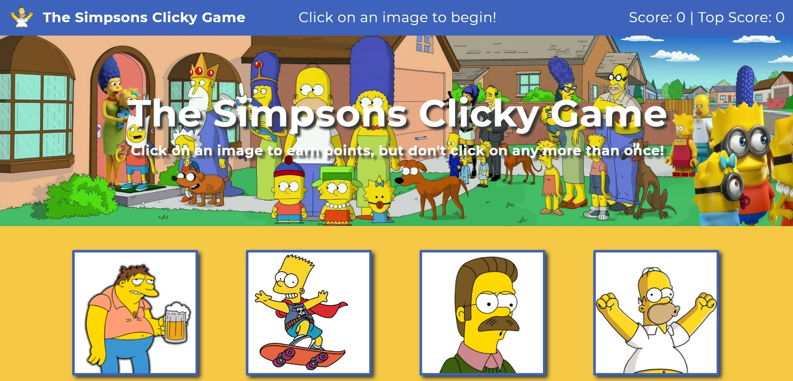

# The Simpsons Clicky Game

# Project Description

The Simpsons Clicky Game is a React application that tests your memory with a Simpsons-themed memory game. The game consists of twelve cards, each with a Simpsons character on it. Each time a card is clicked, the cards are then shuffled randomly in different order. The object of the game is to try to click on all twelve of the cards without clicking the same card twice. The game is over whenever the user clicks on the same card twice. The game is then reset and the score resets to zero. The top score is also recorded, and the user can try to improve on the top score.

This application uses React and Bootstrap. The font used ('Montserrat') comes from Google Fonts. The React icon used in the footer is from Font Awesome.

# Technologies Used

* React
* ES6
* Bootstrap
* CSS

# The Simpsons Clicky Game Live Link

Please check out the live link for The Simpsons Clicky Game here:

https://answebdev.github.io/clicky-game/

# Screenshots

